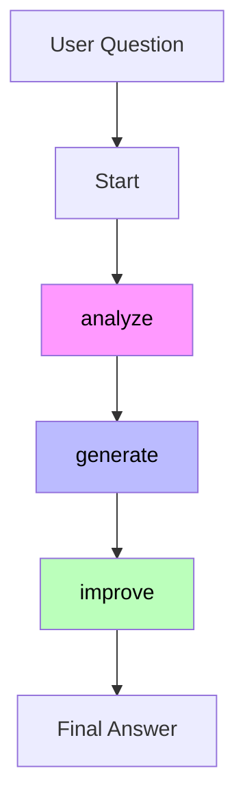
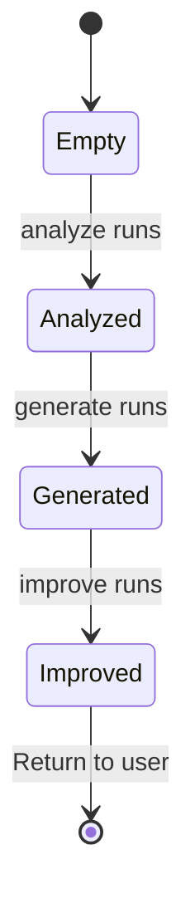
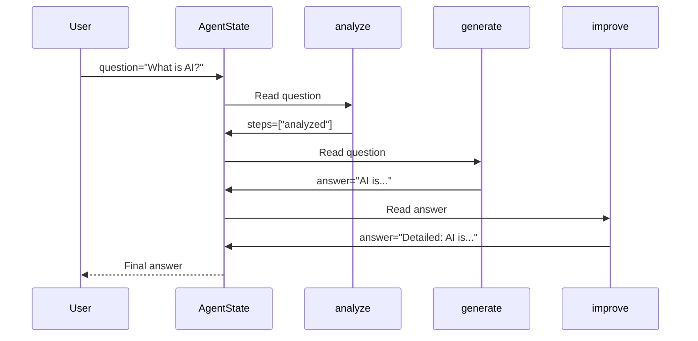
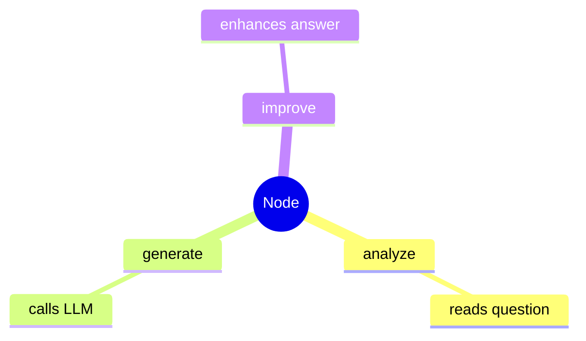
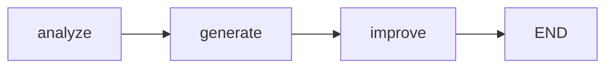

# 📅 DAY 15: LangGraph - Building AI Agents

## 🎯 Today's Mission

**Main Topic:** LangGraph - Multi-step AI Agents
**Why:** LangGraph is how you build production AI agents with memory, loops, and tool use

---

## 📚 Study Material

### Part 1: LangGraph Basics (30 min)

**Concept:** LangGraph = Workers (Nodes) + Conveyor Belts (Edges) + Shared Notebook (AgentState)



### Part 2: AgentState - The Shared Notebook (30 min)

**What data flows between workers:**



### Part 3: Worker Interaction Flow (30 min)

**How workers talk to each other:**



---

## 🛠️ Hands-On Task

### Build Your First LangGraph Agent

**File:** `day15_langgraph_agent.py`

```python
from langgraph.graph import StateGraph, END
from typing import TypedDict, Annotated
import operator

# 1. Define the AgentState (shared notebook)
class AgentState(TypedDict):
    messages: Annotated[list, operator.add]
    question: str
    answer: str
    steps: list

# 2. Create workers (nodes)
def analyze(state: AgentState) -> AgentState:
    """Read and understand the question"""
    question = state["question"]
    print(f"🔍 Analyzing: {question}")
    return {"steps": ["analyzed"]}

def generate(state: AgentState) -> AgentState:
    """Call LLM to generate answer"""
    # In real code: response = llm.invoke(state["question"])
    answer = f"AI stands for Artificial Intelligence - "
    answer += "systems that can learn and make decisions."
    print(f"💡 Generated answer")
    return {"answer": answer, "steps": ["generated"]}

def improve(state: AgentState) -> AgentState:
    """Make answer better"""
    answer = state["answer"]
    improved = f"Here's a detailed answer:\n\n{answer}"
    print(f"✅ Answer improved")
    return {"answer": improved, "steps": ["improved"]}

# 3. Build the workflow (graph)
workflow = StateGraph(AgentState)

workflow.add_node("analyze", analyze)
workflow.add_node("generate", generate)
workflow.add_node("improve", improve)

workflow.set_entry_point("analyze")
workflow.add_edge("analyze", "generate")
workflow.add_edge("generate", "improve")
workflow.add_edge("improve", END)

# 4. Compile and run
agent = workflow.compile()

result = agent.invoke({
    "question": "What is AI?",
    "messages": []
})

print("\n" + "="*50)
print("FINAL ANSWER:")
print("="*50)
print(result["answer"])
```

---

## 📝 Step-by-Step Flow Table

| Step | Worker | What Happens | State After |
|------|--------|--------------|-------------|
| 1 | Start | User submits question | question="What is AI?", answer="", steps=[] |
| 2 | analyze | Reads question | steps=["analyzed"] |
| 3 | generate | Calls LLM | answer="AI is...", steps=["analyzed","generated"] |
| 4 | improve | Adds detail | answer="Detailed: AI is...", steps=["analyzed","generated","improved"] |
| 5 | END | Returns result | Final answer to user |

---

## 🔑 Key Concepts

### 1. Nodes (Workers)


### 2. Edges (Conveyor Belts)


### 3. AgentState (Shared Notebook)
| Field | Type | Purpose |
|-------|------|---------|
| messages | list | Chat history |
| question | str | User input |
| answer | str | LLM output |
| steps | list | What workers did |

---

## ⚠️ Common Mistakes

| WRONG ❌ | CORRECT ✅ |
|----------|-----------|
| `return state` | `return {"steps": ["analyzed"]}` |
| Forgot edge to END | `workflow.add_edge("improve", END)` |
| No TypedDict | Use `class AgentState(TypedDict):` |
| Return entire state | Return only what changed! |

---

## ✅ Checkpoint

- [ ] Understand: Nodes = Workers, Edges = Conveyor Belts
- [ ] Build: Simple 3-node LangGraph agent
- [ ] Run: Agent processes question end-to-end
- [ ] Explain: How AgentState passes between nodes

---

## 🎤 Interview Punch

> "I'm building production AI agents with LangGraph. The key insight is 'decoupling' - nodes only communicate through shared state, not directly. This makes testing easy and allows loops for retry logic. It's how real AI products like Claude and ChatGPT handle multi-step tasks."

---

## 🔗 Resources

- LangGraph Docs: https://langchain-ai.github.io/langgraph/
- Video: LangGraph Crash Course (20 min)

---

## 📊 Today's Progress

| Task | Status |
|------|--------|
| LangGraph basics | ⬜ |
| Build agent | ⬜ |
| Run end-to-end | ⬜ |
| Commit to GitHub | ⬜ |
